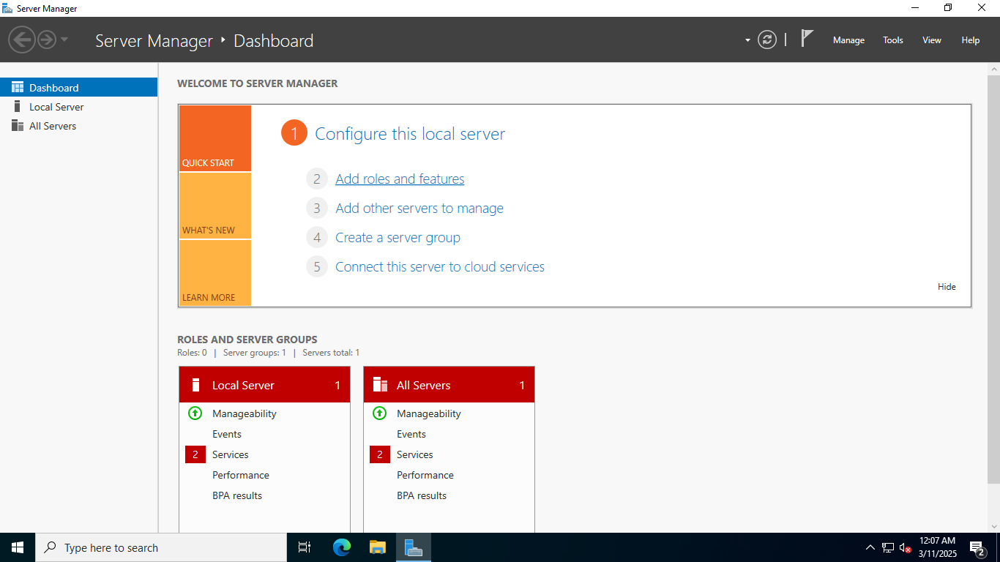
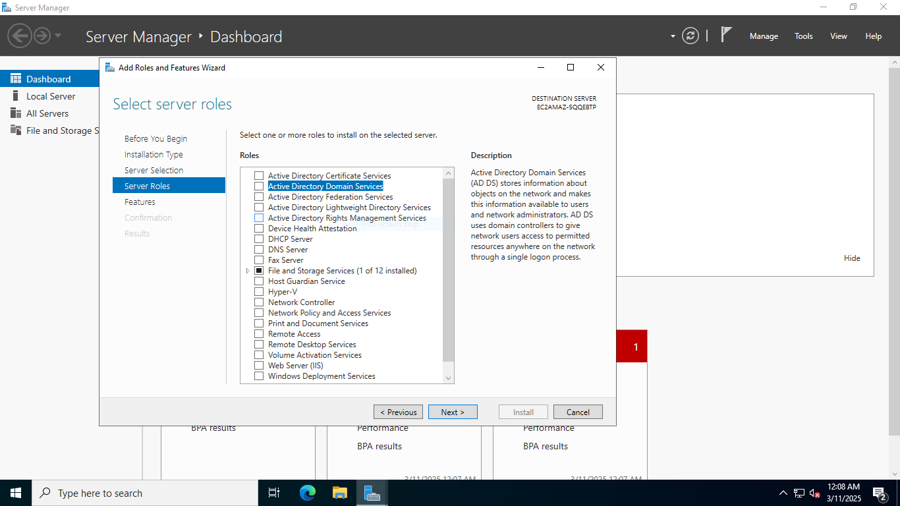
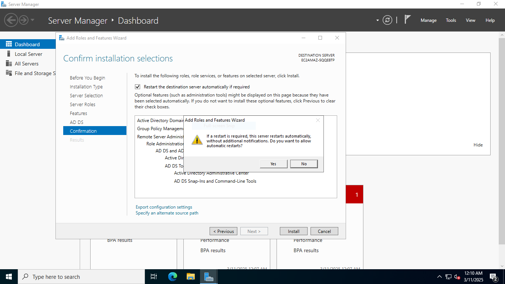

## Configuring Active Directory Domain Services
This tutorial outlines the implementation of on-premises Active Directory. The home lab I used throughout this project, which features two Windows virtual machines in a private subnet, can be created in AWS by following my tutorial [here]().

### Environments and Technologies Used
- Amazon Web Services (AWS) 
- Windows Server 2022
- Active Directory Domain Services
- PowerShell


We will start by installing Active Directory Domain Services on the domain controller.

Active Directory Domain Services (AD DS) centralizes user authentication, authorization, and resource management in a network. It stores user account details, enforces security policies through Group Policy, and organizes resources hierarchically across domains, trees, and forests. AD DS allows administrators to manage users, devices, and access permissions efficiently.

Select **Add roles and features**.



Check the box for **Active Directory Domain Services**.



Check the box to allow the server to restart when necessary.



Promote the server to a domain controller.


Add a new forest and enter the domain name.


## Creating Users and Organizational Units

Organizational Units (OUs) in Active Directory are containers used to organize users, groups, computers, and other objects within a domain. They help structure Active Directory logically, allow administrators to apply Group Policies, and control access to resources more efficiently. OUs can be nested within each other, providing a hierarchical structure that mirrors an organization’s departments or functions.

Open **Active Directory Users and Computers**

We will create two Organizational Units, **_Admins** and **_Users**.


A user account stores details like a username, password, and group memberships, which enable authentication and access to network resources. Users can be assigned permissions and policies to control what they can do within the domain.

Here we will be creating an admin user account and placing it inside the **_Admin** OU.


It is important to decide on a naming convention for the username and stick with it. 


Once the user has been created, right click on it and select **Properties**. Navigate to the **Member Of** tab and select **Add** to add user to the **Domain Admins** security group.


## Join Client Machine to Domain
Log into Client-1 with the new admin account credentials. Navigate to **Network & Internet settings** and select the network adapter's properties. 


Connect Client-1 to the domain (myhomelab.com) by modifying its DNS settings to match the private IP address of the domain controller. Remember that the DC was assigned a static IP address when we defined the instance in CloudFormation.


Next, navigate to the system settings, select **About** and then **Advanced System Settings**. Click change the domain. 


Enter *myhomelab.com* and provide the necessary credentials. Once this is complete, the computer will restart and Client-1 will become part of the *myhomelab.com* domain.


## Creating Users Using PowerShell
Next we will create five users, this time using the command line. I've provided a PowerShell script with five names hard coded. 

```powershell
$PASSWORD_FOR_USERS = Read-Host "Enter default password" -AsSecureString 
$ouPath = "OU=_Users,DC=myhomelab,DC=com" # Existing OU Distinguished Name


$names = @(
    "Aaron Judge",
    "Gary Sanchez",
    "Tyler Wade",
    "Mike Tauchman",
    "Brady Lail"
)

foreach ($n in $names) {
        $first    = $n.Split(" ")[0].ToLower()
        $last     = $n.Split(" ")[1].ToLower()
        $username = "$($first.Substring(0, 1))$($last)".ToLower()
        Write-Host "Creating user: $($username)" -ForegroundColor Green

        New-AdUser -AccountPassword $PASSWORD_FOR_USERS `
            -GivenName $first `
            -Surname $last `
            -DisplayName "$first $last" `
            -Name $username `
            -EmployeeID $username `
            -PasswordNeverExpires $true `
            -Path $ouPath `
            -Enabled $true
}
```

Run PowerShell ISE as an Administrator, open the provided script, and click the green play button.


If we take a look at the **Users and Computers** we will see the users were created and placed into the **_Users** OU.


Log into Client-1 and open system settings. Click on **Remote Desktop** and grant access to **Domain Users**. Now normal users should be able to log into Client-1 using remote desktop access


Log into the client machine using one of the users created by the script. 


This concludes the tutorial on configuring Active Directory Domain Services in a home lab. 

If you followed along and set up the lab in AWS, make sure to stop both instances or delete the stack to release the resources. Remember, the lab template is reusable, and you can recreate or modify your setup at any time. By using Infrastructure as Code (IaC), you've made the process more efficient and easier to manage for future use."


